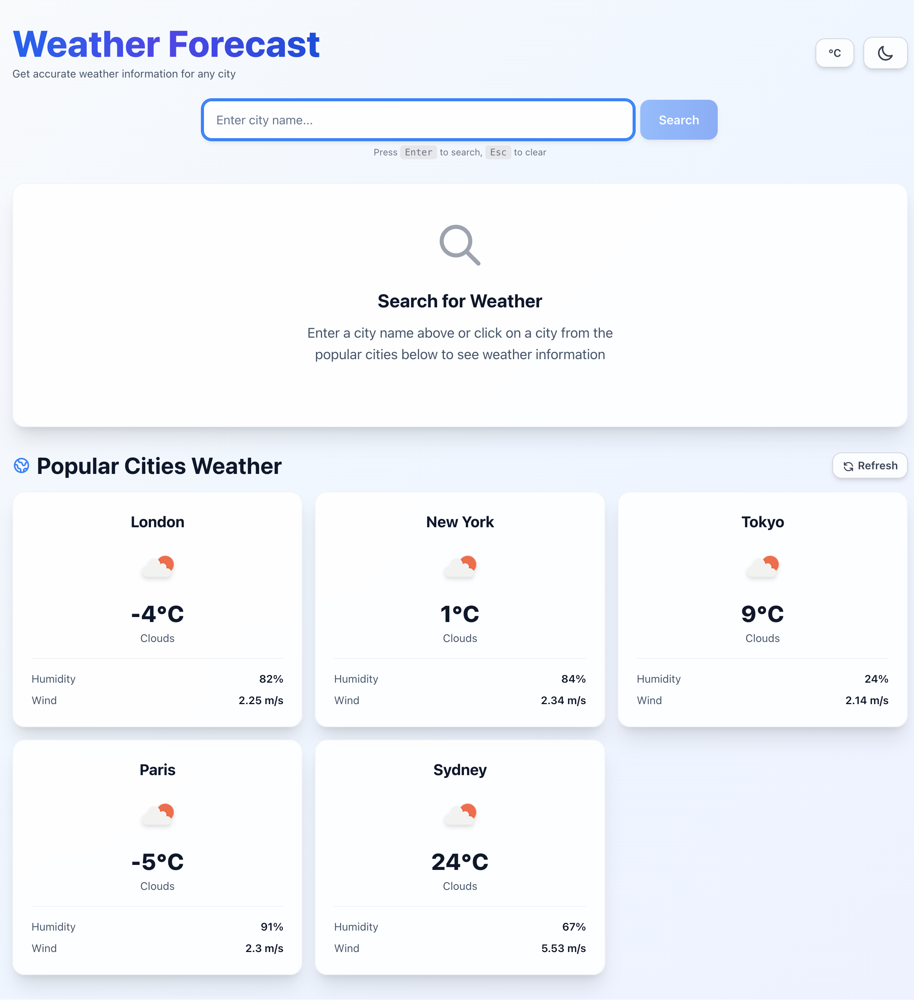
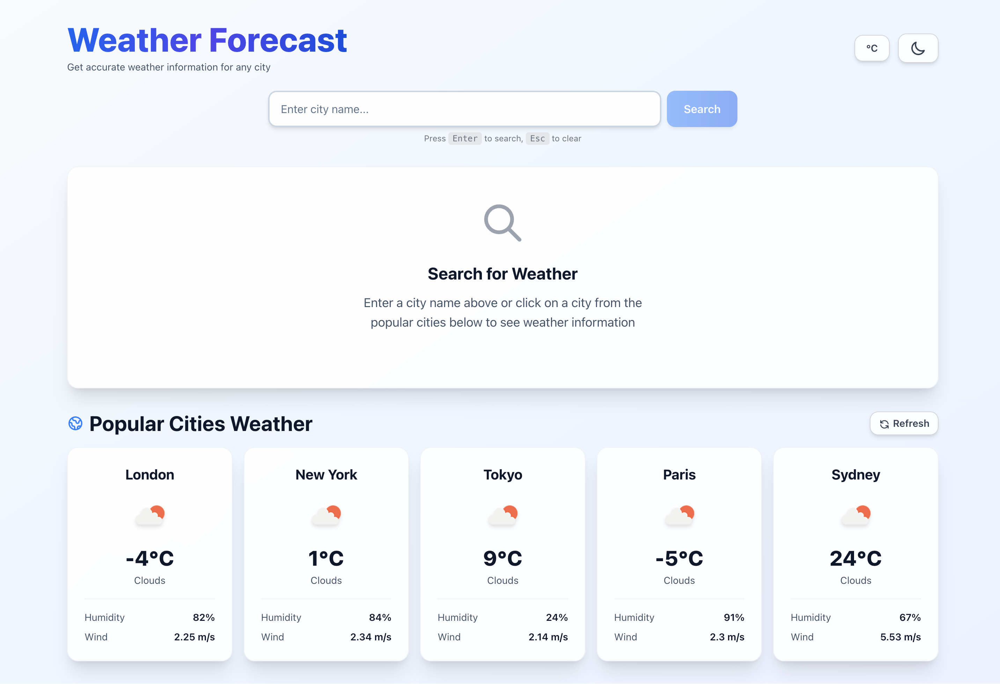
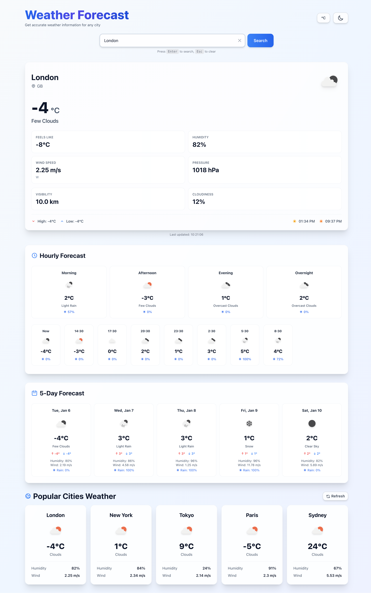
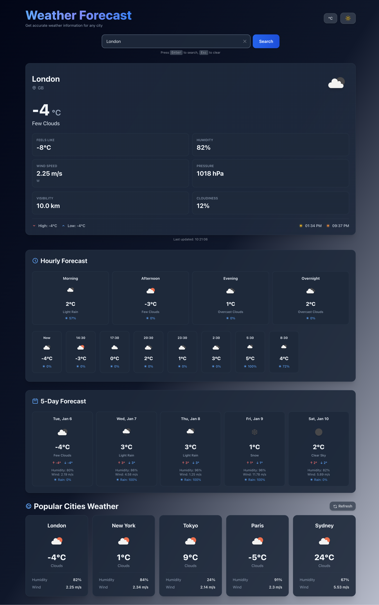

# Weather Forecast Web Application

A modern, responsive weather forecasting application built with Next.js, TypeScript, and Tailwind CSS.

## Screenshots

### Light Mode


### Dark Mode


### Weather Details - Light Mode


### Weather Details - Dark Mode


## Features

- 🌤️ **Real-time Weather Data** - Fetch current weather from OpenWeatherMap API
- 📊 **5-Day Forecast** - View weather predictions for the next 5 days
- 🌍 **25 City Weather Table** - Browse weather data for 25 popular cities with pagination
- 🌙 **Dark Mode** - Toggle between light and dark themes
- 📍 **Auto-detect Location** - Automatically detect and show weather for your location
- 🌡️ **Unit Toggle** - Switch between Celsius (°C) and Fahrenheit (°F)
- ⚡ **Skeleton Loading** - Beautiful loading states while fetching data
- 📱 **Responsive Design** - Works seamlessly on all device sizes

## Tech Stack

- **Next.js 14** - React framework with App Router
- **TypeScript** - Type-safe development
- **Tailwind CSS** - Utility-first CSS framework
- **OpenWeatherMap API** - Weather data provider

## Getting Started

### Prerequisites

- Node.js 18+ installed
- OpenWeatherMap API key (free at [openweathermap.org](https://openweathermap.org/api))

### Installation

1. Clone the repository:
```bash
git clone <repository-url>
cd assignment-himanshu
```

2. Install dependencies:
```bash
npm install
```

3. Create a `.env.local` file in the root directory:
```bash
NEXT_PUBLIC_WEATHER_API_KEY=your_api_key_here
```

4. Run the development server:
```bash
npm run dev
```

5. Open [http://localhost:3000](http://localhost:3000) in your browser.

## Project Structure

```
assignment-himanshu/
├── app/
│   ├── layout.tsx          # Root layout
│   ├── page.tsx            # Main page component
│   └── globals.css         # Global styles
├── components/
│   ├── SearchBar.tsx       # City search component
│   ├── WeatherCard.tsx     # Current weather display
│   ├── WeatherTable.tsx    # Cities weather table
│   ├── Forecast.tsx        # 5-day forecast
│   ├── DarkModeToggle.tsx  # Dark mode switcher
│   ├── UnitToggle.tsx      # Temperature unit switcher
│   └── SkeletonLoader.tsx  # Loading skeletons
├── hooks/
│   ├── useDarkMode.ts      # Dark mode hook
│   └── useGeolocation.ts   # Geolocation hook
├── lib/
│   ├── weatherApi.ts       # API functions
│   └── utils.ts            # Utility functions
├── types/
│   └── weather.ts          # TypeScript interfaces
└── package.json
```

## Features Implementation

### Weather Data Integration
- Uses OpenWeatherMap API for real-time weather data
- Handles loading and error states gracefully
- Supports both city search and geolocation-based queries

### React & Next.js
- Functional components with React Hooks (useState, useEffect)
- Next.js App Router architecture
- Client-side rendering for interactivity
- Proper TypeScript types throughout (no `any` types)

### UI Components
- Reusable, modular components
- Responsive Tailwind CSS styling
- Smooth animations and hover effects
- Accessible design patterns

## Environment Variables

Create a `.env.local` file with:

```
NEXT_PUBLIC_WEATHER_API_KEY=your_openweathermap_api_key
```

## Build for Production

```bash
npm run build
npm start
```

## License

This project is created for educational purposes.

